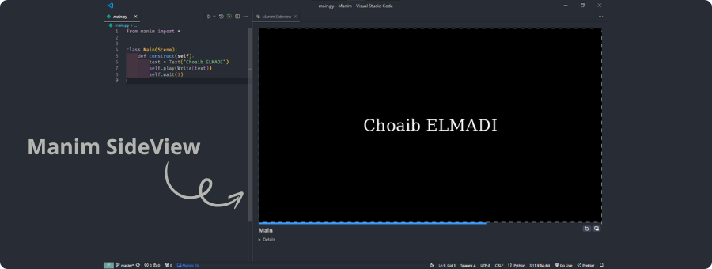

[](https://elmadichoaib.vercel.app) 

# Learning Manim

This repository contains my learning notes, example code, and projects as I explore [Manim](https://www.manim.community/), a powerful library for creating mathematical animations. The goal of this repository is to document my journey, reinforce concepts, and share resources that others might find helpful.

<div align="center">


</div>

## Contents

- **Learning Notes**: Concepts and Manim functions I find useful as I progress.
- **Examples**: Small animations created to reinforce each concept or feature.
- **Projects**: Projects that demonstrate applied concepts through animations.

## Goals

- To build a strong foundation in using Manim for mathematical animations.
- To create a set of notes, examples, and projects that will benefit others who are learning Manim.
- To document my progress and ideas through various Manim concepts and techniques.

## Technical Requirements

To use Manim, you will need:

- Python 3.8 or higher
- Manim dependencies (specific installation instructions below)

Having some experience with Python will also be helpful as Manim projects are coded in Python.

## Installation

To get started, follow these steps to install Manim on your system:

### Step 1: Install Chocolatey for Individual Use

1. **Open an administrative shell** (such as PowerShell run as administrator).

2. Run the following command to check the execution policy:

```powershell
Get-ExecutionPolicy
```

If it returns `Restricted`, adjust it by running one of the following:

```powershell
Set-ExecutionPolicy AllSigned
```

or

```powershell
Set-ExecutionPolicy Bypass -Scope Process
```

3. Install Chocolatey by running this command:

```powershell
Set-ExecutionPolicy Bypass -Scope Process -Force; [System.Net.ServicePointManager]::SecurityProtocol = [System.Net.ServicePointManager]::SecurityProtocol -bor 3072; iex ((New-Object System.Net.WebClient).DownloadString('https://community.chocolatey.org/install.ps1'))
```

### Step 2: Install Manim with Chocolatey

Once Chocolatey is installed, use the following commands to install Manim:

1. Install the community edition of Manim:

```powershell
choco install manimce
```

2. Install LaTeX support for Manim:

```powershell
choco install manim-latex
```

### Step 3: Install Necessary VS Code Extensions

To enhance your development environment, you should install the following extensions in Visual Studio Code:

- **Python**: Provides support for Python syntax highlighting, debugging, and IntelliSense.
- **Pylance**: Offers fast and feature-rich Python language support, with type checking, IntelliSense, and more.
- **Manim SideView**: A useful extension for visualizing Manim animations directly within VS Code, providing a side-by-side preview.

<div align="center">



</div>

You can install these extensions directly from the VS Code Extensions Marketplace.


Make sure the folders for your Manim projects **do not contain spaces**. Spaces in folder names can cause issues when running your Manim program, leading to errors during execution. It's recommended to use underscores `_` or hyphens `-` instead of spaces to ensure smooth execution.

Feel free to explore each folder to access these resources and projects!
